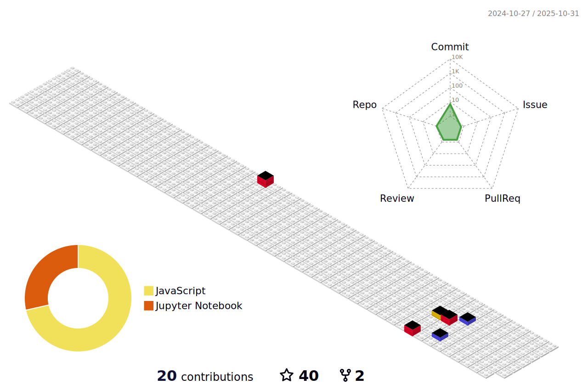

<!--  -->
<h1 align="center">Hello 👋 , I'm Abdullah Ibn Rafique &nbsp; 
<!--&nbsp; &nbsp;  </h1> -->

<h3 align="center"> Passionate Software Engineer and MEAN & MERN Enthusiastic.</h3> 
<!--  -->

<!--  -->

  

I'm a current Software Engineering undergraduate student looking for an opportunity to put my skills to good use and make a difference. My experience covers web development and full-stack web development in Java, JavaScript, HTML, CSS, and React.Js.
I'm learning the MERN stack in order to advance my skills in the field of cutting-edge technology. I'm always looking for new ways to improve myself.  I'm here to do Full-Stack Web development for you on your business. 

### 🛠 &nbsp;Tech Stack
&nbsp;
&nbsp;
&nbsp;
&nbsp;
&nbsp;
&nbsp;
&nbsp;
&nbsp;
&nbsp;
&nbsp;
&nbsp;
&nbsp;
&nbsp;
&nbsp;
&nbsp;

<!-- connect with me -->
<h4 align="center">🤙🏼 &nbsp;Connect With Me </h4>

    <!-- https://raw.githubusercontent.com/rahuldkjain/github-profile-readme-generator/master/src/images/icons/Social/devto.svg -->

 

<!--  
 -->

<!-- \ -->
<!-- &nbsp; -->
<!-- &nbsp; -->
<!-- &nbsp; -->
<!-- &nbsp; -->

<!-- \
&nbsp;
&nbsp;
 -->

## My Statistics

<!--
 

  

 
-->

 

<!--

 -->

<!--
&nbsp;
 -->

<!--

-->

<!-- 

 -->

<!-- 
 -->
<!--  -->
<!--  -->

## Contribution Graph

## Have a Smiley Day...😃 : 

<!--  -->
  
<h2 align='center'>Support Me By Starring ⭐ Some Of My Repositories</h2>
 

</img>

 
<!--  -->
